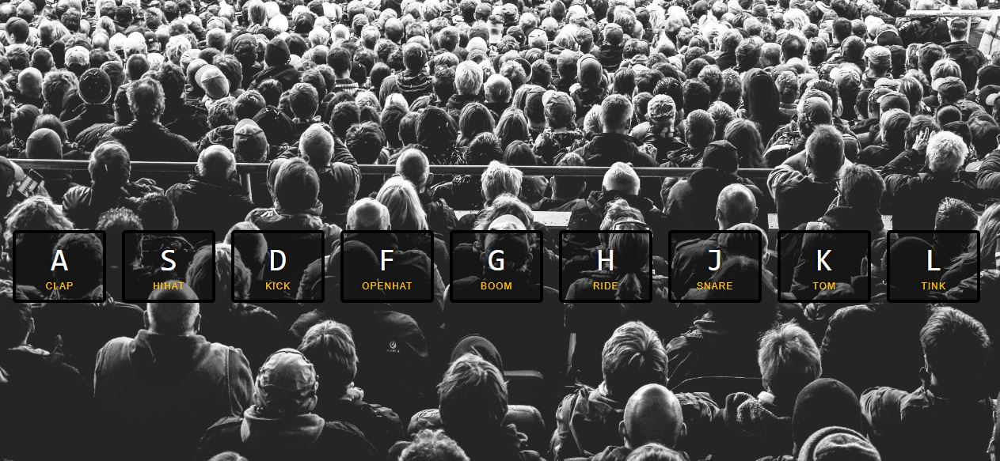

# JavaScript Drum Kit
> This is drum kit created in JavaScript. By push the buttons on screen you can play a lot of sounds.

## Screenshots

## Technologies
* HTML
* CSS
* JavaScript
* GIT

## Status
Project is: *done*

## Inspiration
Project based on JavaScript30 course by Wes Bos.

## Contact
Created by [Damian Jackiewicz](https://www.linkedin.com/in/damian-jackiewicz/) - feel free to contact me!
